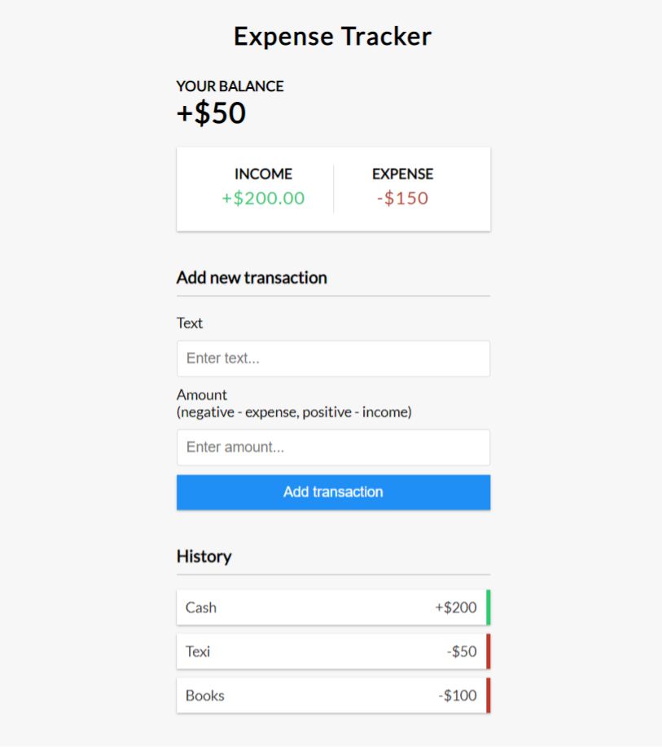

# Expense Tracker (React)
Keep track of income and expenses.
This is a React version of the[vanilla JS Expense Tracker](https://github.com/bradtraversy/vanillawebprojects/tree/master/expense-tracker).I converted it to React. Used react-toastify for alert message.

## Usage

``` 
npm install

# Run on http://localhost:3000
npm start

# Build for prod
npm run build
```

### screenshot


